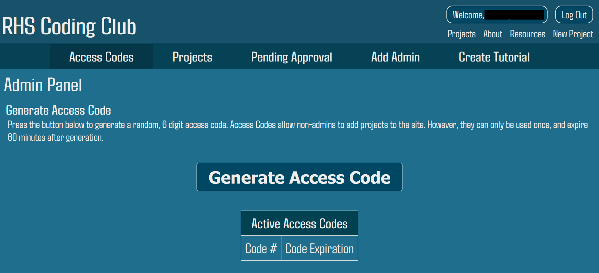

# RHSCoding-Public
The RHS Programming Club's website. Go to https://rhscoding.onrender.com

## Table of Contents
1. [Access Codes](#access-codes)
2. [Google Drive Integration](#google-drive-integration)
3. [ReCaptcha Integration](#recaptcha-integration)
4. [Tutorials + Markdown](#tutorials)
5. [bcrypt Integration](#bcrypt-integration)

## Access Codes

In order to add a new project to the site, one must be an admin, or they must receive a temporary access code that allows them to add a single project.

Additional, projects added throught access codes must then be approved by an admin before actually appearing on the site.

## Google Drive Integration
Project cover images are stored in Google Drive using a service account and the Google Drive API.

## ReCaptcha Integration
In order to sign in, admins must pass a captcha verification test, usually done in the background, although sometimes that annoying image select thing happens 🤷.

## Tutorials
Utilizing Markdown syntax, which is sanitized on the server, admins can create useful tutorials to educate any users.

## bcrypt Integration
Admins have their login information securely stored utilizing ```bcrypt``` for a one-way hash.